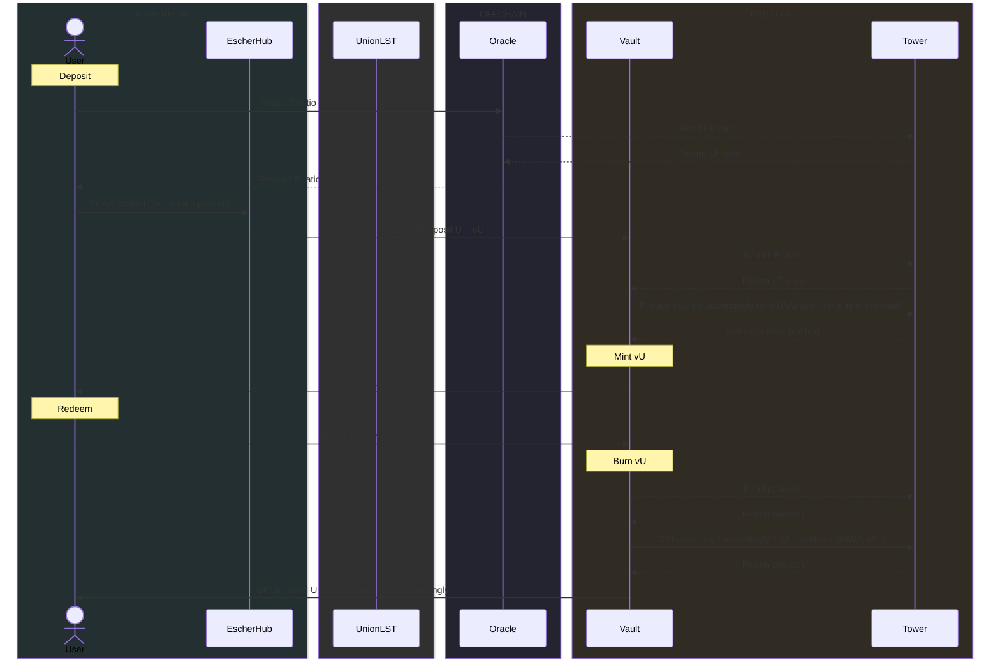

# CW4626 Escher

```mermaid
sequenceDiagram
    box rgb(35, 47, 48) ETHEREUM
    actor User
    participant EscherHub
    end
    box rgb(48, 48, 48) UNION
    participant UnionLST
    end
    box rgb(35, 36, 48) OFFCHAIN
    participant Oracle
    end
    box rgb(48, 43, 35) BABYLON
    participant Vault
    participant Tower
    end

    Note over User: Deposit
    User->>Oracle: Read LP ratio
    Oracle-->>Tower: Read LP ratio
    Tower-->>Oracle: Return LP ratio
    Oracle-->>User: Return LP ratio
    User->>EscherHub: ZKGM stake U (+ LP ratio payload)
    EscherHub->>Vault: ZKGM deposit U + eU
    Vault-->>Tower: Read LP ratio
    Tower-->>Vault: Return LP ratio
    Vault->>Tower: Provide liquidity accordingly (any U/eU dust remains in the vault)
    Tower-->>Vault: Return current position
    Note over Vault: Mint vU
    Vault->>User: ZKGM Send vU

    Note over User: Redeem
    User->>Vault: ZKGM Send vU
    Note over Vault: Burn vU
    Vault-->>Tower: Read position
    Tower-->>Vault: Return position
    Vault->>Tower: Withdraw % LP accordingly + all incentives (BABY, etc.)
    Tower-->>Vault: Return position
    Vault->>User: ZKGM Send U + eU + BABY + etc. accordingly
```
