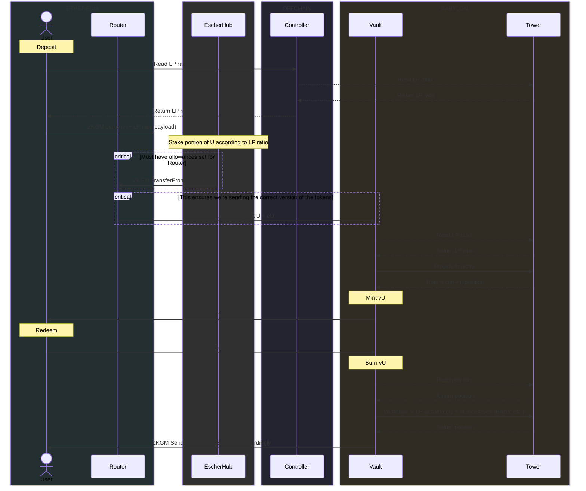

# CW4626 Escher

```mermaid
sequenceDiagram
    box rgb(35, 47, 48) ETHEREUM
    actor User
    participant Router
    end
    box rgb(48, 48, 48) UNION
    participant EscherHub
    end
    box rgb(35, 36, 48) OFFCHAIN
    participant Controller
    end
    box rgb(48, 43, 35) BABYLON
    participant Vault
    participant Tower
    end

    Note over User: Deposit
    User->>Controller: Read LP ratio
    Controller-->>Tower: Read LP ratio
    Tower-->>Controller: Return LP ratio
    Controller-->>User: Return LP ratio
    User->>EscherHub: ZKGM stake U (+ LP ratio payload)
    Note over EscherHub: Stake portion of U according to LP ratio
    critical Must have allowances set for Router
    EscherHub->>Router: ZKGM TransferFrom U + eU
    end
    critical This ensures we're sending the correct version of the tokens
    Router->>Vault: ZKGM deposit U + eU
    end
    Vault-->>Tower: Read LP ratio
    Tower-->>Vault: Return LP ratio
    Vault->>Tower: Provide liquidity
    Tower-->>Vault: Return current position
    Note over Vault: Mint vU
    Vault->>User: ZKGM Send vU

    Note over User: Redeem
    User->>Vault: ZKGM Send vU
    Note over Vault: Burn vU
    Vault-->>Tower: Read position
    Tower-->>Vault: Return position
    Vault->>Tower: Withdraw % LP accordingly + all incentives (BABY, etc.)
    Tower-->>Vault: Return position
    Vault->>User: ZKGM Send U + eU + BABY + etc. accordingly
```
