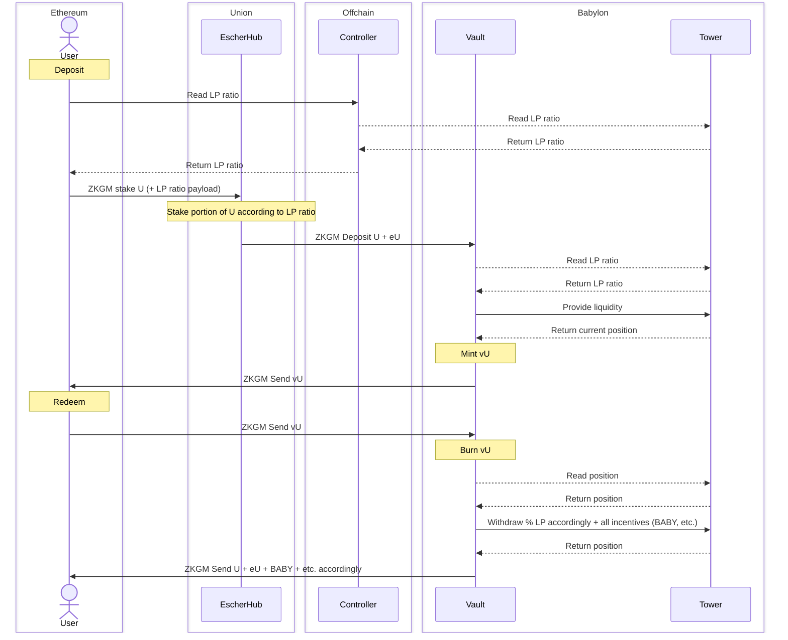

```mermaid
sequenceDiagram
    box Ethereum
    actor User
    end
    box Union
    participant EscherHub
    end
    box Offchain
    participant Controller
    end
    box Babylon
    participant Vault
    participant Tower
    end

    Note over User: Deposit
    User->>Controller: Read LP ratio
    Controller-->>Tower: Read LP ratio
    Tower-->>Controller: Return LP ratio
    Controller-->>User: Return LP ratio
    User->>EscherHub: ZKGM stake U (+ LP ratio payload)
    Note over EscherHub: Stake portion of U according to LP ratio
    EscherHub->>Vault: ZKGM Deposit U + eU
    Vault-->>Tower: Read LP ratio
    Tower-->>Vault: Return LP ratio
    Vault->>Tower: Provide liquidity
    Tower-->>Vault: Return current position
    Note over Vault: Mint vU
    Vault->>User: ZKGM Send vU

    Note over User: Redeem
    User->>Vault: ZKGM Send vU
    Note over Vault: Burn vU
    Vault-->>Tower: Read position
    Tower-->>Vault: Return position
    Vault->>Tower: Withdraw % LP accordingly + all incentives (BABY, etc.)
    Tower-->>Vault: Return position
    Vault->>User: ZKGM Send U + eU + BABY + etc. accordingly
```
